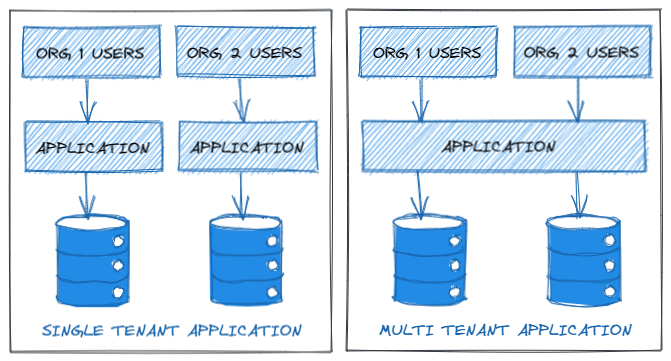

# CS ASPNET Core Multitenancy

Proyecto para ejemplificar la multiple tenencia en una aplicación.

## Configuración:

Migrar base de datos

```bash
update-database
```

## ¿Qué Es MultiTenancy?

La tenencia múltiple es un patrón arquitectónico en el que un sistema de software puede servir a múltiples grupos de usuarios u organizaciones. Los productos SAAS (Software As A Service) son un excelente ejemplo de arquitectura multiusuario.

Por lo general familiarizados con la tenencia única, donde una API/Servicio que es utilizada por un solo grupo de usuarios o una sola organización. En este escenario, se necesita la implementación de una sola aplicación para cada nuevo conjunto de usuarios u organizaciones.

Imaginemos que tenemos una aplicación que necesitan varias organizaciones o grupos de usuarios. Se sabe que la aplicación tendrá la misma base de código para todos los usuarios. En tal escenario, ¿es siempre inteligente implementar la misma aplicación una y otra vez para cada uno de los inquilinos? ¿No aumenta el costo y el mantenimiento de la infraestructura? ¿No es más inteligente diseñar una aplicación de tal manera que pueda acomodar a varios grupos de usuarios en una sola implementación? Esto puede reducir drásticamente el número de implementaciones y los costos del servidor.



Aquí, la primera sección demuestra la aplicación de un inquilino único habitual donde se necesitan implementaciones separadas por inquilino. Inquilino se refiere al grupo de usuarios o la Organización/Compañía que desea utilizar nuestra aplicación. Se puede ver que cada uno de los inquilinos necesitará una implementación completa de la infraestructura.
Mientras que, en la segunda sección, varios inquilinos comparten la implementación de una sola aplicación. Los inquilinos también pueden optar por compartir la base de datos o tener una base de datos completamente aislada para ellos mismos.

## Estrategias De Acceso A La Base De Datos

Para que la aplicación Multitenant se comunique con la base de datos, existen esencialmente las siguientes estrategias.

### Separación de esquemas

Esta es una de las estrategias menos utilizadas en la que cada inquilino obtendrá su propia tabla de base de datos, separada por el nombre del esquema. Digamos que una aplicación tiene 3 inquilinos, alfa, beta y gamma. Sus tablas de productos se verán así:

- [alpha].[Productos]
- [beta].[Productos]
- [gamma].[Productos]

De esta forma, existe una clara separación de los datos del inquilino.

### Base de datos única (separación de columnas de inquilinos)

Este es un enfoque bastante popular en el que la aplicación tiene solo una base de datos y todos los inquilinos comparten la aplicación y la base de datos. Este es un enfoque más económico cuando no hay muchas operaciones de datos en la aplicación.

Cada una de las tablas tendrá una columna adicional `'TenantId'`, que se encargará de filtrar los datos por inquilinos.

TenantId | UserName | NormalizedUserName
--- | --- | ---
dotnet | dotnet.admin | DOTNET.ADMIN
java | java.admin | JAVA.ADMIN

Cuando sus inquilinos están preocupados por la seguridad de los datos y tienen mucho flujo de datos, esta puede no ser una solución ideal. Hay muchas posibilidades de que el desarrollador se olvide de filtrar el tenantId de un servicio que potencialmente también puede exponer los datos de otros inquilinos. Además, cuando un inquilino necesita mucho espacio de datos, este enfoque no será muy ideal.

### Base de datos múltiple: aislamiento completo de datos

En este enfoque, cada uno de los inquilinos puede disfrutar de una base de datos separada y, por lo tanto, completar el aislamiento y la seguridad de los datos. Esta es la solución más preferida cuando se trata de multipropiedad.

```text
SQLServer  
    |  
    --- Databases  
            |  
            --- [dbo].[alpha]  
            |  
            --- [dbo].[beta]  
            |  
            --- [dbo].[gamma]  
```

### Enfoque híbrido

Aquí hay un enfoque interesante, donde diseñamos una aplicación que puede permitir a los inquilinos elegir si necesitan una base de datos separada o compartida. Esto puede ser importante cuando sabe que no todos los inquilinos van a tener un uso elevado de la base de datos. A los inquilinos que utilizan la base de datos de forma mínima se les puede asignar el uso de la base de datos compartida, mientras que los inquilinos con mayor uso intensivo de datos pueden optar por tener una base de datos separada. Esto también tiene un impacto económico positivo.

## Identificación De Inquilinos

### Cadena de consulta

Este es un mecanismo simple, en el que el inquilino puede identificarse mediante una cadena de consulta. Es tan simple como pasar ``'? TenantId = alpha'`` en la URL de la solicitud y la aplicación llega a saber que esta solicitud es para inquilinos alfa. Como esta estrategia tiene varias vulnerabilidades, se recomienda utilizar este enfoque solo para fines de prueba y desarrollo.

### Solicitar dirección IP

Aquí, asumimos que cada solicitud de inquilino se generará a partir de un rango de IP particular. Una vez que se establece un rango de IP para un inquilino, la aplicación puede detectar a qué inquilino pertenece. Aunque este es un enfoque seguro, no siempre es conveniente utilizarlo.

### Encabezado de solicitud

Esta es una estrategia más sólida para identificar a los inquilinos. Cada una de las solicitudes tendrá un encabezado con TenantID. Luego, la aplicación atiende la solicitud para ese inquilino en particular. Se recomienda utilizar este enfoque al solicitar tokens de autenticación únicamente.

### Reclamación

Una forma más segura de detectar inquilinos. En los sistemas donde los tokens JWT están involucrados para la autenticación, el tenantId del usuario se puede codificar en los reclamos del token. Este enfoque garantiza que la solicitud esté autenticada y pertenezca a un usuario del inquilino mencionado.

---

:octocat: [Follow me](https://github.com/FernandoCalmet)

[](https://ko-fi.com/T6T41JKMI)